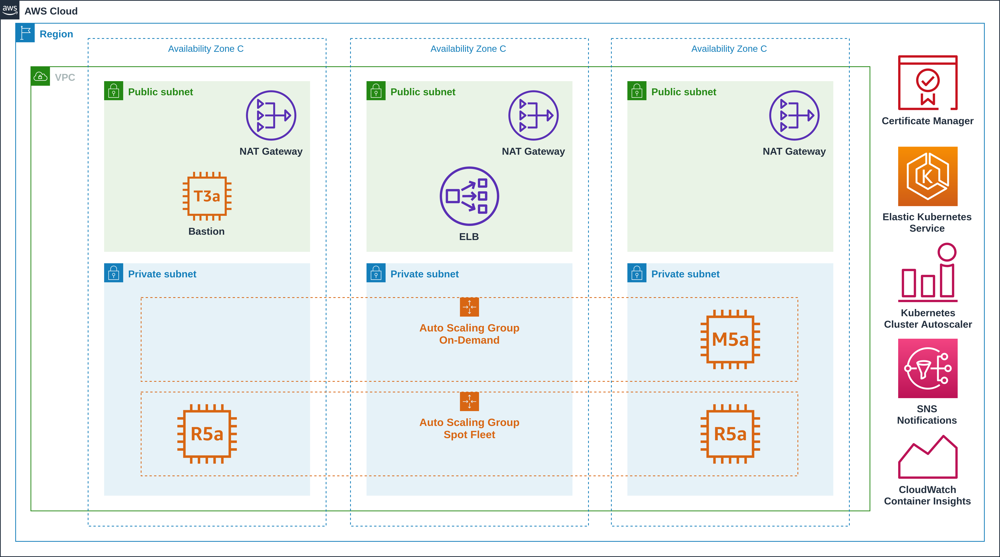

# Amazon Elastic Container Service for Kubernetes - EKS

[](https://opensource.org/licenses/Apache-2.0)



Kubernetes es un software de código abierto que le permite implementar y administrar aplicaciones en contenedores a escala. Kubernetes administra clústeres de instancias de informática de Amazon EC2 y ejecuta contenedores en ellas con procesos destinados a implementación, mantenimiento y escalado.

## Prerequisite


* [Instalar Terraform](https://learn.hashicorp.com/terraform/getting-started/install.html)
* [Instalar AWS CLI](https://docs.aws.amazon.com/cli/latest/userguide/cli-chap-install.html)

**NOTA:** Configurar las credenciales en el servicio [AWS CLI](https://docs.aws.amazon.com/cli/latest/reference/configure/).

Como depedencia se necesita una infraestructura base debidamente etiquetada para poder detectar automaticamente los distintos componentes de red. Para esto podemos seguir la siguiente plantilla de VPC:

* [Amazon Virtual Private Cloud](https://github.com/punkerside/terraform-aws-template-vpc)

## Recursos desplegados

### Amazon AWS

* Elastic Container Service for Kubernetes (EKS)
* EC2 [Spot Instances](https://aws.amazon.com/es/ec2/spot/)
* EC2 Auto Scaling
* Elastic Load Balancing (ELB)
* Identity and Access Management (IAM)
* CloudWatch Container Insights
* Certificate Manager
* Simple Notification Service
* Route 53

### Kubernetes

* Web UI (Dashboard)
* Metrics Server
* Cluster Autoscaler (CA)
* NGINX Ingress Controller
* GuestBook (app demo)

## Inicio rápido

Para desplegar toda la infraestructura necesaria de una forma rapida podemos ejecutar:

```bash
make quickstart
```

* Descarga de modulos y binarios de Terraform.
* Despliegue de infraestructura.
* Configurar kubectl y workers contra el cluster EKS.
* Instalar Dashboard.
* Instalar Nginx Ingress.


* Configurar DNS del Nginx Ingress.
* Desplegar contenedores demo.

Para validar el funcionamiento de los servicios demo y del Nginx Ingress se deben realizar las siguientes consultas web:

* http://eks.punkerside.com/coffee
* http://eks.punkerside.com/tea

## Inicio personalizado

Desplegar infraestructura cloud y complementos Kubernetes:

```bash
make quickstart WORKER_SIZE=2 AWS_REGION=us-west-2
```

## Variables


NODE_VER = 1.14
NODE_DES = 2
NODE_MIN = 1
NODE_MAX = 10


| Name | Description | Type | Default | Required |
|------|-------------|:----:|:-----:|:-----:|
| OWNER | Nombre del propietario | string | punkerside | no |
| PROJECT | Nombre del proyecto | string | eks | no |
| ENV | Nombre del entorno | string | demo | no |
| AWS_REGION | Region de AWS | string | `us-east-1` | no |
| AWS_DOMAIN | Dominio de DNS | string | `punkerside.com` | no |
| NODE_VER | Version de Kubernetes | string | `1.14` | no |
| NODE_DES | Numero de nodos | string | `2` | no |
| NODE_MIN | Numero minimo de nodos para el escalamiento| string | `2` | no |
| NODE_MAX | Numero minimo de nodos para el escalamiento| string | `2` | no |

## Eliminar

Para eliminar la infraestructura creada y archivos temporales:

```bash
make delete
```