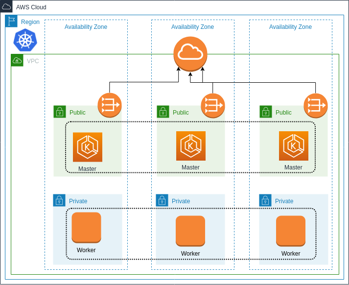
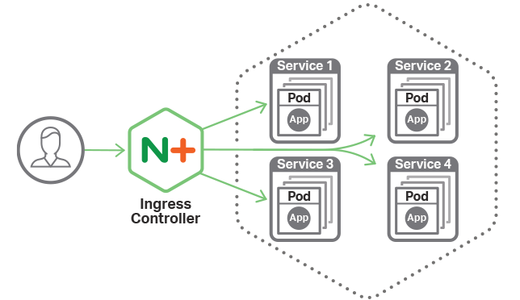

# Amazon Elastic Container Service for Kubernetes - EKS

[](https://travis-ci.org/punkerside/terraform-aws-template-eks)
[](https://github.com/punkerside/terraform-aws-template-eks/issues)
[](https://github.com/punkerside/terraform-aws-template-eks/tags/)
[](https://opensource.org/licenses/Apache-2.0)



Kubernetes es un software de código abierto que le permite implementar y administrar aplicaciones en contenedores a escala. Kubernetes administra clústeres de instancias de informática de Amazon EC2 y ejecuta contenedores en ellas con procesos destinados a implementación, mantenimiento y escalado. Con Kubernetes puede ejecutar cualquier tipo de aplicación en contenedor mediante el uso del mismo conjunto de herramientas para entornos en las instalaciones y en la nube.

AWS facilita la ejecución de Kubernetes en la nube mediante una infraestructura de máquinas virtuales escalable y de alta disponibilidad, integraciones en servicios respaldadas por la comunidad y Amazon Elastic Container Service for Kubernetes (EKS), un servicio administrado de Kubernetes que cuenta con certificación de conformidad.

## Prerequisite

Se debe tener en cuenta que es necesario configurar las credenciales en el servicio [AWS CLI](https://docs.aws.amazon.com/cli/latest/reference/configure/).

* [Instalar Terraform](https://learn.hashicorp.com/terraform/getting-started/install.html)
* [Instalar AWS CLI](https://docs.aws.amazon.com/cli/latest/userguide/cli-chap-install.html)
* Crear bucket S3 con el siguiente formato: **owner**-prod-terraform

**NOTA:** Al crear el bucket **"owner"** debe ser cambiado por el nombre del cliente.

Como depedencia se necesita una infraestructura base debidamente etiquetada para poder detectar automaticamente los distintos componentes de red. Para esto podemos seguir la siguiente plantilla de VPC:

* [Amazon Virtual Private Cloud](https://github.com/punkerside/terraform-aws-template-vpc)

## Recursos desplegados

Esta plantilla de Terraform, despliega los siguientes recursos:

* Amazon Elastic Container Service for Kubernetes (EKS)
* Amazon EC2 [Spot Instances](https://aws.amazon.com/es/ec2/spot/)
* Amazon EC2 Auto Scaling
* Amazon Identity and Access Management (IAM)

## Inicio rápido

Para desplegar toda la infraestructura necesaria de una forma rapida podemos ejecutar:

```bash
make quickstart
```

* Descarga de modulos y binarios de Terraform.
* Despliegue de infraestructura.
* Configurar kubectl y workers contra el cluster EKS.
* Instalar Dashboard.
* Instalar Nginx Ingress.



* Configurar DNS del Nginx Ingress.
* Desplegar contenedores demo.

Para validar el funcionamiento de los servicios demo y del Nginx Ingress se deben realizar las siguientes consultas web:

* http://eks.punkerside.com/coffee
* http://eks.punkerside.com/tea

## Inicio personalizado

Para desplegar toda la infraestructura:

```bash
make quickstart WORKER_SIZE=2 AWS_REGION=us-west-2
```

## Variables

| Name | Description | Type | Default | Required |
|------|-------------|:----:|:-----:|:-----:|
| OWNER | Propietario | string | punkerside | no |
| PROJECT | Proyecto | string | vpc | no |
| ENV | Entorno | string | lab | no |
| AWS_REGION | Region de AWS | string | `us-east-1` | no |
| DNS_DOMAIN | Nombre de DNS | string | `punkerside.com` | no |
| WORKER_TYPE | Tipo de instancia | string | `m5.large` | no |
| WORKER_PRICE | Precio maximo a pagar por instancia | string | `0.045` | no |
| WORKER_SIZE | Numero de workers | `1` | no |

## Eliminar

Para eliminar la infraestructura creada y archivos temporales:

```bash
make delete
```